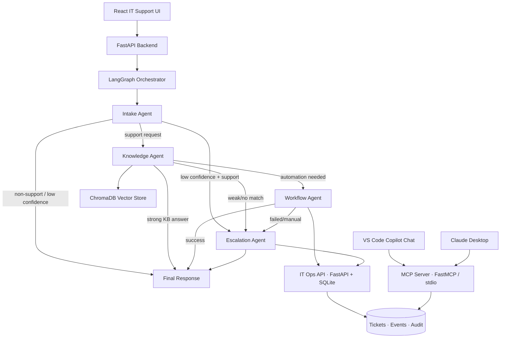

# IT Support AI — Architecture

The same SQLite database is reachable through two transports:

- HTTP (`POST /api/v1/tickets`, …) for the web backend.
- MCP (`create_ticket`, `list_tickets`, `analyze_logs`, …) for VS Code and Claude Desktop.

That is the standardization point of the Model Context Protocol: the LangGraph
agent and an editor like VS Code call **the same tool contracts** without each
having to know the other's API.
