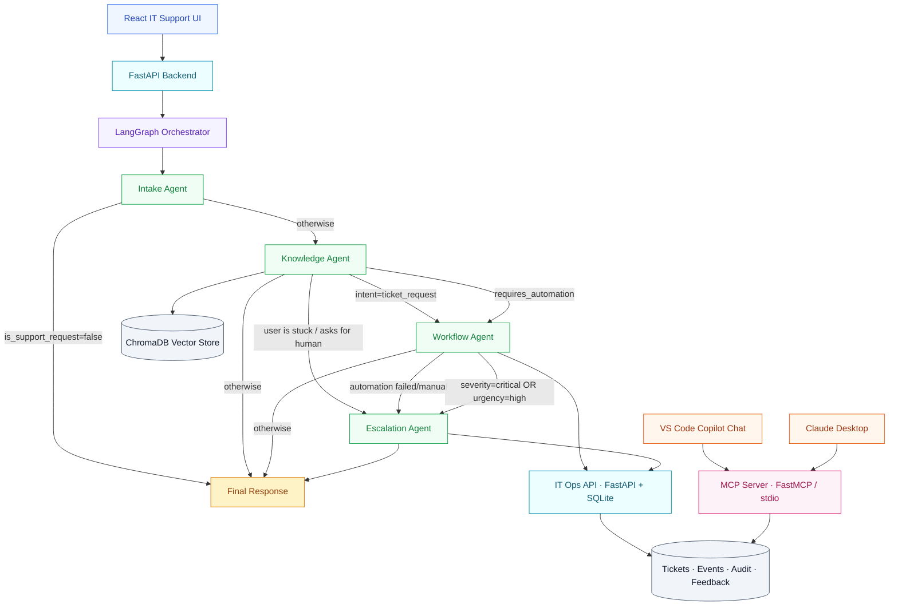
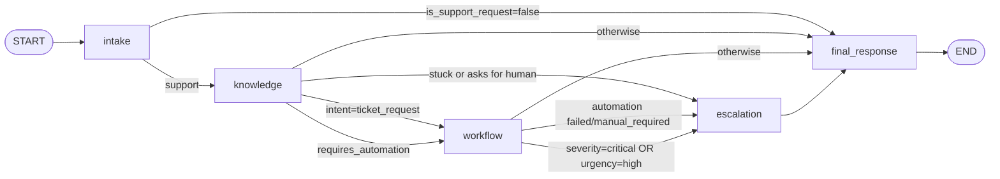

# IT Support AI — Architecture

## High-level system

The same SQLite database is reachable through two transports:

- HTTP (`POST /api/v1/tickets`, …) for the web backend.
- MCP (`create_ticket`, `list_tickets`, `analyze_logs`, …) for VS Code
  Copilot Chat and Claude Desktop.

That is the standardisation point of the Model Context Protocol: the
LangGraph agent and an editor like VS Code call **the same tool contracts**
without each having to know the other's API.

## Conditional routing detail

Every conditional edge above is unit-tested in `tests/test_routing.py` —
each branch has at least one scenario that walks through it, with the
expected `route_trace` checked literally.

## State carried between agents

`AgentState` (in `backend/agents/orchestrator.py`) carries:

- `category`, `intent`, `confidence`, `severity`, `urgency`,
  `is_support_request`, `requires_automation` — set by Intake.
- `match_strength`, `sources`, `context` — set by Knowledge.
- `automation_status`, `automation_result`, `automation_simulated`,
  `should_create_ticket`, `ticket_decision_reason`, `ticket`,
  `ops_api_unavailable` — set by Workflow.
- `escalated`, `ticket` (priority bumped) — set by Escalation.
- `route_trace`, `final_route`, `response_time_ms` — appended by every
  node and stamped by `process_message`.

The `/chat` API response surfaces the diagnostic fields verbatim so the
chat UI can render them under each turn (the "Route trace" strip in
`frontend/src/pages/ChatPage.jsx`).

## Why this layout

- **One agent = one decision.** Intake classifies, Knowledge retrieves,
  Workflow acts, Escalation hands off. Each agent has a small fixed
  contract over `AgentState`. New behaviours plug into the existing
  agent that owns that decision.
- **Routing is data, not heuristics buried in agent bodies.** Routing
  functions in `orchestrator.py` are pure: they read state and return a
  node name. Tests can exercise them in isolation.
- **MCP is the integration boundary.** The same store that the LangGraph
  agent writes to via the HTTP ops API is the one MCP clients read from
  and write to over stdio. No second source of truth.
