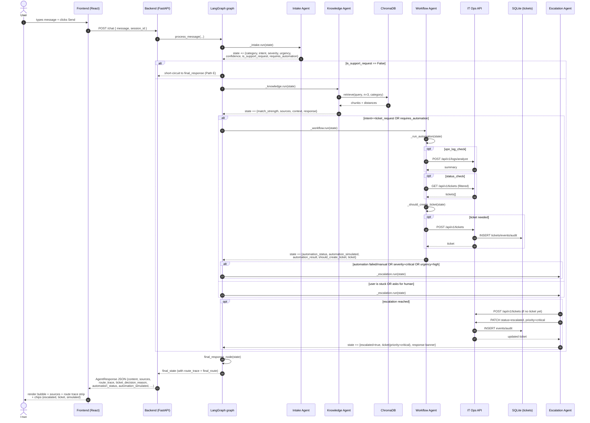
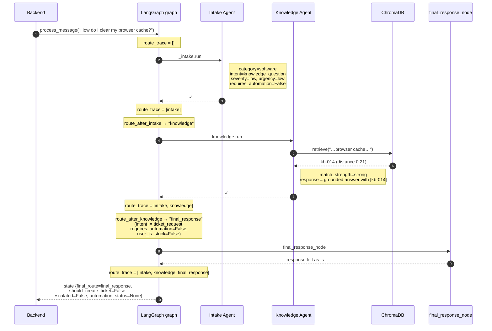
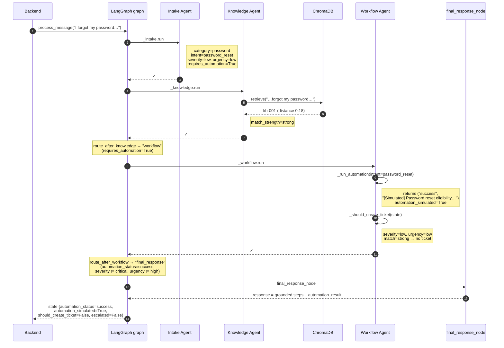
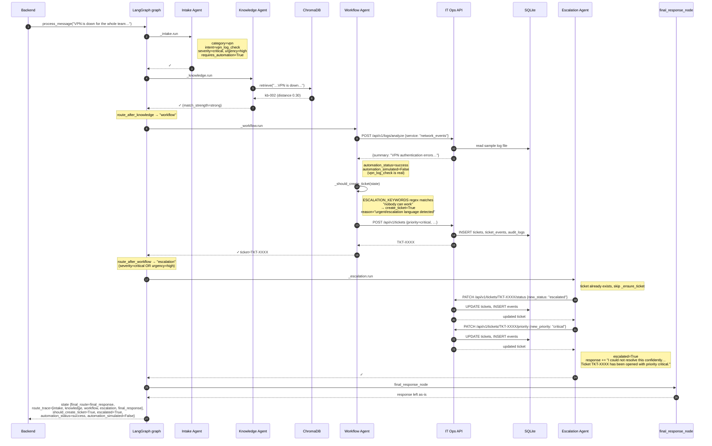
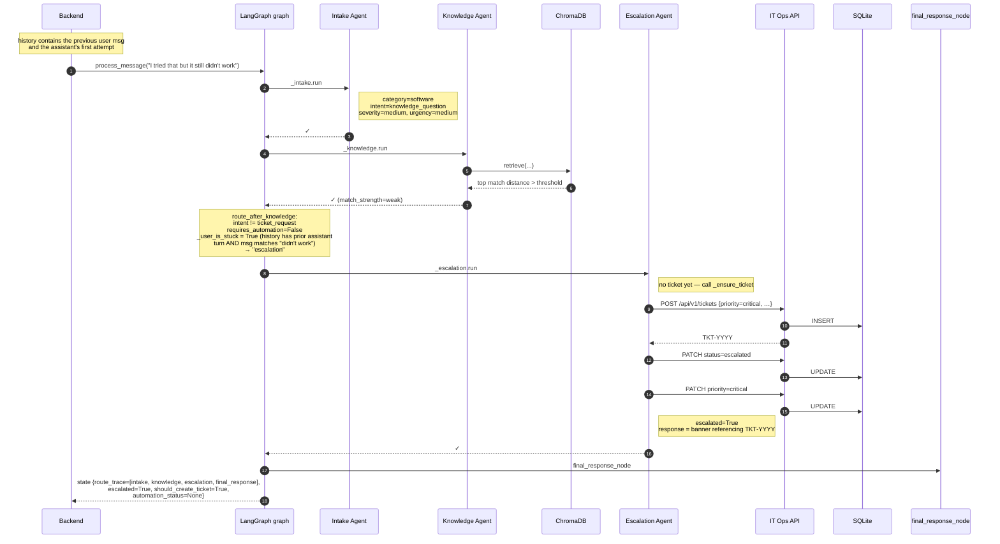
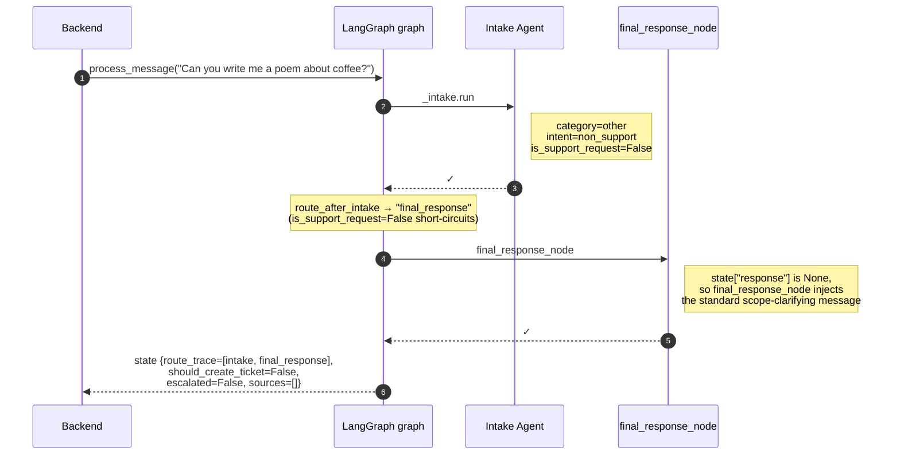
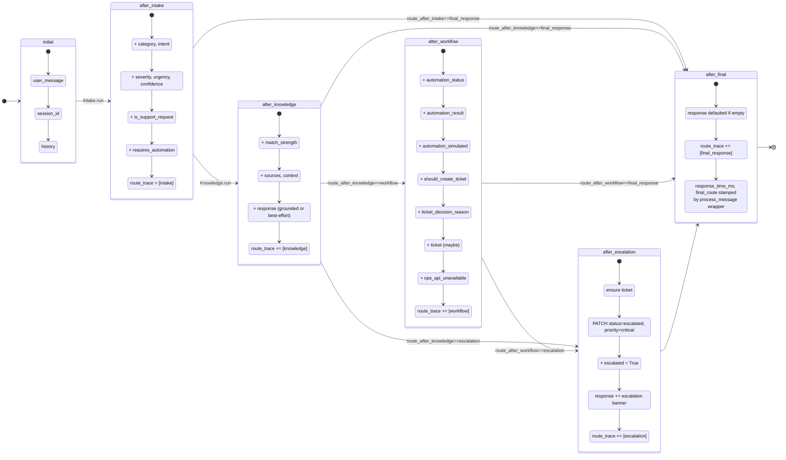
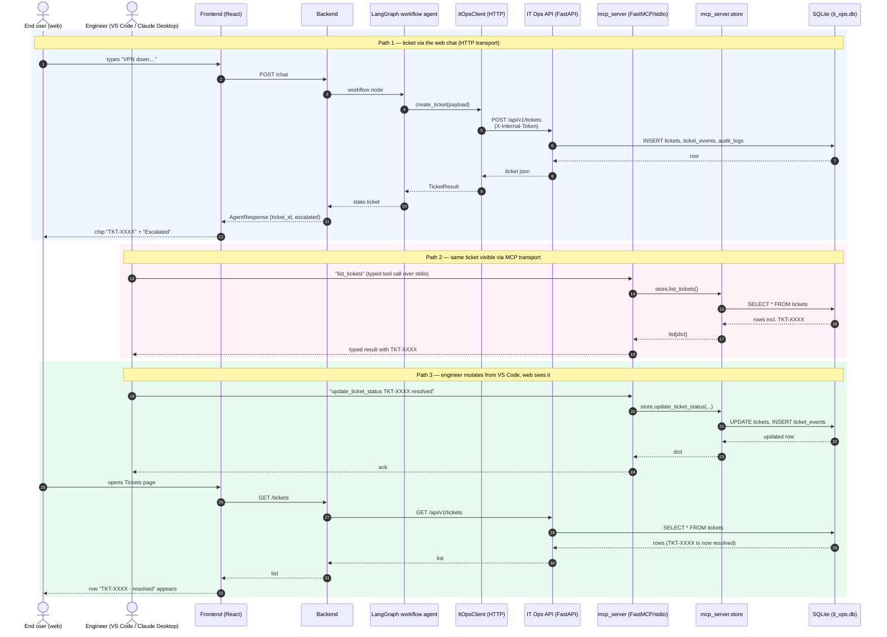

# Workflow diagrams

This file shows **how a single chat turn flows through the system** for
each of the canonical user paths. Where [`architecture.md`](architecture.md)
shows the static topology, this file shows what actually moves and in
what order.

Every diagram below is annotated with the file/function the call lands
in, so you can grep the code path directly. Every diagram is also
covered by a deterministic scenario in
[`../tests/test_routing.py`](../tests/test_routing.py).

Contents:

1. [End-to-end pipeline (overview)](#1-end-to-end-pipeline-overview)
2. [Path A — Knowledge-only ("How do I clear my browser cache?")](#2-path-a--knowledge-only)
3. [Path B — Simulated automation ("I forgot my password")](#3-path-b--simulated-automation)
4. [Path C — Urgent escalation ("VPN is down for the whole team")](#4-path-c--urgent-escalation)
5. [Path D — Weak match + user is stuck ("I tried that but it still didn't work")](#5-path-d--weak-match--user-is-stuck)
6. [Path E — Non-support request ("Write me a poem about coffee")](#6-path-e--non-support-request)
7. [State lifecycle — what each node writes to AgentState](#7-state-lifecycle)
8. [Cross-transport: ticket via MCP vs ticket via HTTP](#8-cross-transport-ticket-via-mcp-vs-ticket-via-http)

---

## 1. End-to-end pipeline (overview)

The skeleton every path shares. Specific paths short-circuit at the
conditional edges shown in
[`architecture.md`](architecture.md#conditional-routing-detail).

**Code anchors:** `process_message` is in
[`backend/agents/orchestrator.py:215`](../backend/agents/orchestrator.py).
The graph is built in `_build_graph` at line 163.

---

## 2. Path A — Knowledge-only

**Scenario id:** `kb_browser_cache` —
_"How do I clear my browser cache?"_

What the user sees: a numbered procedure with a citation block.
No ticket, no chip noise.

---

## 3. Path B — Simulated automation

**Scenario id:** `password_reset_automation` —
_"I forgot my password and need a reset link."_

What the user sees: the runbook steps, plus a `[Simulated]` line, plus
a "Simulated automation" chip under the bubble. No ticket — the
automation said it succeeded and the message wasn't urgent.

---

## 4. Path C — Urgent escalation

**Scenario id:** `urgent_vpn_outage_escalates` —
_"VPN is down for the whole team and nobody can work."_

What the user sees: the procedure + the log summary + an explicit
escalation banner with the ticket id + a red "Escalated" chip + an
amber ticket-id chip. Route trace shows all five nodes fired.

---

## 5. Path D — Weak match + user is stuck

**Scenario id:** `weak_kb_user_gets_stuck` —
follow-up turn _"I tried that but it still didn't work"_ after a prior
attempt at _"Outlook will not open this morning"_.

What the user sees: an explicit escalation banner. No automation
attempted (it isn't an automatable intent). Route trace shows
`escalation` immediately after `knowledge` — the workflow node was
skipped because the user was stuck, not asking for an action.

---

## 6. Path E — Non-support request

**Scenario id:** `non_support_request` —
_"Can you write me a poem about coffee?"_

What the user sees: a friendly "I can help with passwords, VPN,
software, hardware, network, access, email, or security…" scope
message. No KB lookup, no ticket, no escalation, no LLM-generated
poem (deliberate — out of scope for an IT assistant).

---

## 7. State lifecycle

`AgentState` (defined in
[`backend/agents/orchestrator.py:55`](../backend/agents/orchestrator.py))
is a single `TypedDict` that every node mutates. This diagram shows
which fields are _written_ by each node — read access is everywhere.

The "+" prefix means a field is being **written** at that node; reads
happen everywhere upstream.

---

## 8. Cross-transport: ticket via MCP vs ticket via HTTP

This is the diagram that proves the standardisation claim — both
transports converge on the **same** SQLite store. The arrows show what
the cross-transport proof test (`tests/test_mcp_proof.py`) actually
exercises.

**Code anchors:**

- HTTP transport entry: `services/it_ops_api/main.py:111` (`create_ticket`).
- MCP transport entry: `mcp_server/tools/__init__.py:14` (`@mcp.tool create_ticket`).
- Shared store: `mcp_server/store.py` (uses the same SQLModel engine
  declared in `services/it_ops_api/db.py`).

---

## How to verify these diagrams are accurate

Each diagram corresponds to a deterministic test scenario:

| Diagram         | Test                          | Command         |
| --------------- | ----------------------------- | --------------- |
| Path A          | `kb_browser_cache`            | `make test`     |
| Path B          | `password_reset_automation`   | `make test`     |
| Path C          | `urgent_vpn_outage_escalates` | `make test`     |
| Path D          | `weak_kb_user_gets_stuck`     | `make test`     |
| Path E          | `non_support_request`         | `make test`     |
| Cross-transport | full proof                    | `make test-mcp` |

If a diagram drifts from the code, the corresponding test scenario
fails. That's the contract.

See [`../tests/results/latest-summary.md`](../tests/results/latest-summary.md)
for the latest run; [`../docs/VALIDATION.md`](../docs/VALIDATION.md) for
the full methodology.
